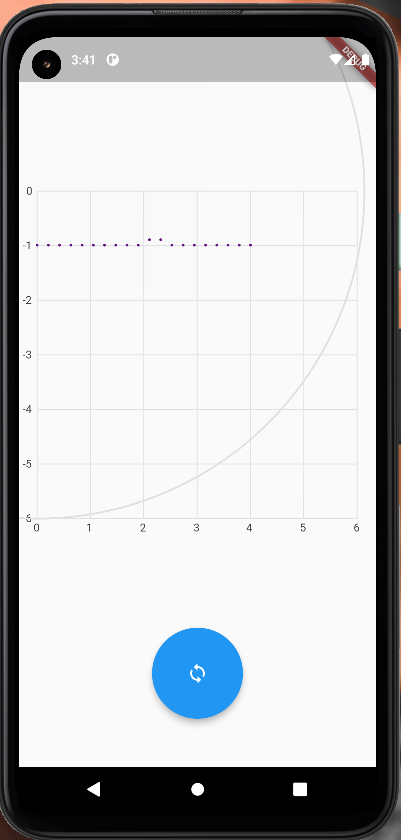

# Gelin

Package generates random doted lines in area defined by a circle.



## Features

- Random doted lines generation within random ar defined segments of a circle.
- Widget for representation on generated lines.


## Getting started

TODO: List prerequisites and provide or point to information on how to
start using the package.

## Usage

```dart
class _MyPageState extends State<MyPage> {
  @override
  Widget build(BuildContext context) {
    return Scaffold(
      body: SafeArea(
        child: Column(
          children: [
            const SizedBox(
              height: 100,
            ),
            SizedBox(
              height: 400,
              width: 400,
              child: () {
                // Calling in random segment generator
                var gen =
                RandomCurvesInRandomSegmentGenerator(minEnd: 0, maxEnd: 4);
                // Calling generation for defined segment
                // var gen = RandomCurvesInDefinedSegmentGenerator(
                //     minEnd: 1, maxEnd: 4, segment: Segment.bottomRight);
                // Building a widget
                return CurvesPlotter()
                    .plot(distort: true, curvesGenerator: gen);
              }(),
            ),
            const SizedBox(
              height: 100,
            ),
            SizedBox(
              height: 100,
              width: 100,
              child: FloatingActionButton(
                  onPressed: () => setState(() {}),
                  child: const Icon(Icons.sync)),
            )
          ],
        ),
      ),
    );
  }
}

```

## Additional information


